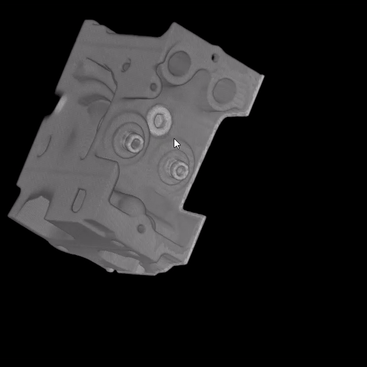

# 3D визуализация - Каневский Даниил
[Ссылка на хранилище проекта](https://github.com/Mihail20052005/PoroMarker-BPM-22-1)
## Задача
Создание библиотеки для 3d визуализации пор на основе обработанных КТ-сканов, с помощью алгоритма volume rendering

## Библиотеки
* OpenGL
* GLUT
* glew

## Что сделано
* реализована библиотека, подключаемая с помощью include <volren/volren.hpp>
* обработка raw файлов размером 256x256x128
* 3D визуализация, возможность изменять положение камеры мышкой и W-A-S-D, а также сбрасывать положение камеры кнопкой BACKSPACE

## Инструкция по сборке
```bash
git clone https://github.com/danyatalent/misis2023f-22-01-kanevskiy-d-e.git
cmake --toolchain /home/danya/submodules/vcpkg/scripts/buildsystems/vcpkg.cmake -S . -B build
cmake --build build --config Release
cmake --install ./build/ --config release --prefix cmd/
```

Затем
```bash
cd cmd/bin && ./test_app data/engine256x256x128.raw
```

## Результат работы


## Что планируется добавить
* обработка tiff файлов
* дать пользователю возможность выбирать другой размер файла(пока только разработчик имеет такую возможность)


